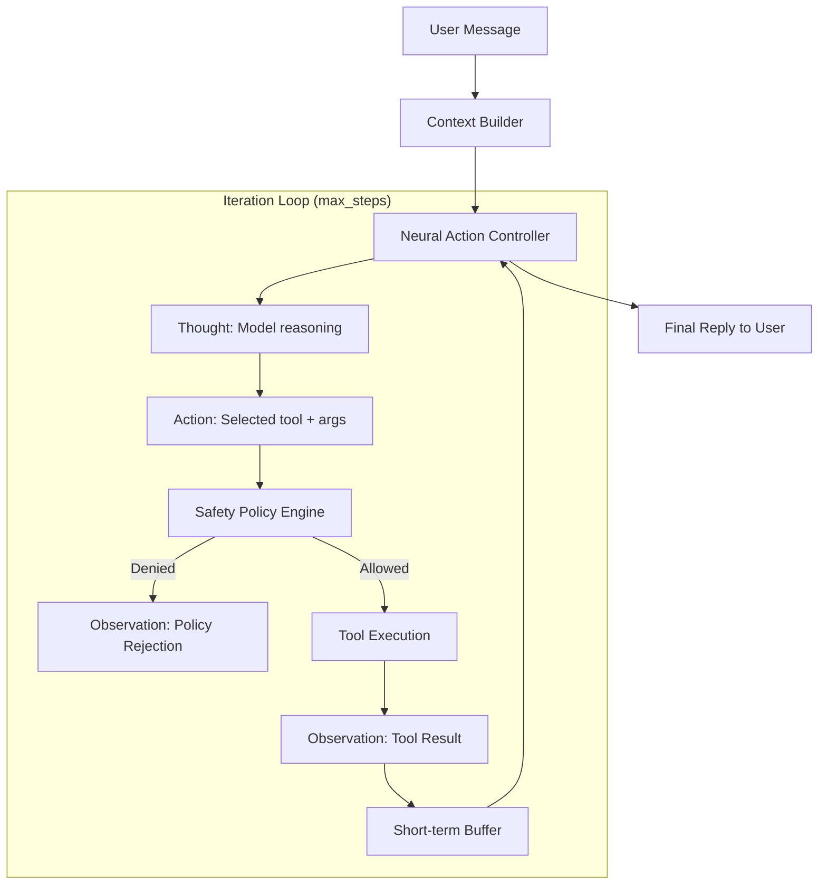

# AI Lan: Agency & Routing Map 🗺️

This document maps the flow of thought, action, and memory within the AI Lan agentic ecosystem.

---

## 🔄 The Iterative ReAct Loop

AI Lan uses an iterative **Reasoning + Acting** loop, where each turn informs the next.

## 🧠 Memory Architecture: Hybrid Retrieval

AI Lan combines semantic (Vector) and exact (Keyword) retrieval to inject the most relevant context into the prompt.

- **Vector Memory:** Uses local embeddings to find semantically similar past turns or documents.
- **Keyword Memory:** Uses token overlap (BM25-style) to find exact matches for names, commands, or technical terms.
- **Short-Term Buffer:** Keeps the most recent 40 turns of conversation in the active context window.

## 🛠️ Tool & Routing Registry

| Action | Handler | Category | Safety Level |
| :--- | :--- | :--- | :--- |
| `web.search` | `run_search` | Web | Low |
| `memory.search` | `_memory_search_tool` | Knowledge | Low |
| `context.build` | `_context_build_tool` | Internal | Low |
| `pc.inspect_screen` | `capture_screen_text` | Perception | Low |
| `pc.type_text` | `type_text` | Desktop | Medium (Conf. Req) |
| `pc.open_app` | `open_app` | System | Medium (Conf. Req) |
| `android.tap` | `tap_screen` | Mobile | Medium (Conf. Req) |

---

## 📂 Key Files & Functions

### 1. Planning & Reasoning
- `agents/react/controller.py`: `NeuralActionController.plan_iterative`
  - Orchestrates the multi-step loop.
- `agents/react/prompt.py`: `build_react_prompt`
  - Formats the context, history, and tools into a ReAct-compatible prompt.

### 2. Action Routing
- `router/dispatch_core.py`: `dispatch_agent_action`
  - Validates schemas, checks safety policies, and executes tool handlers.
- `safety/policy_engine.py`: `evaluate_action_policy`
  - Enforces the Phase 4.0 allowlist and confirmation gates.

### 3. Perception & Tools
- `tools/perception/vision.py`: `capture_screen_text`
  - Bridges the visual environment to the agent using screenshots and OCR.
- `tools/context_builder.py`: `build_prompt_context`
  - Synthesizes vector memory and corpus snippets into a unified prompt block.

### 4. Runtime & Interface
- `runtime/chat_interface.py`: `ChatSession.handle_message`
  - The main entry point for user interaction, managing sessions and state.
