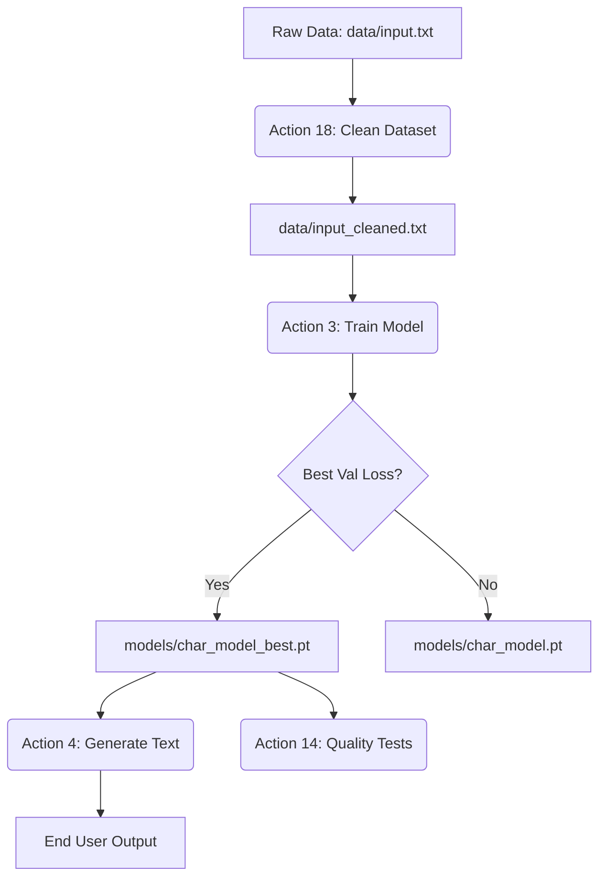
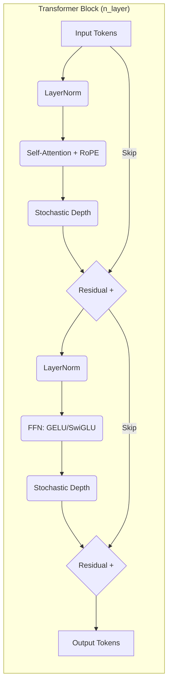
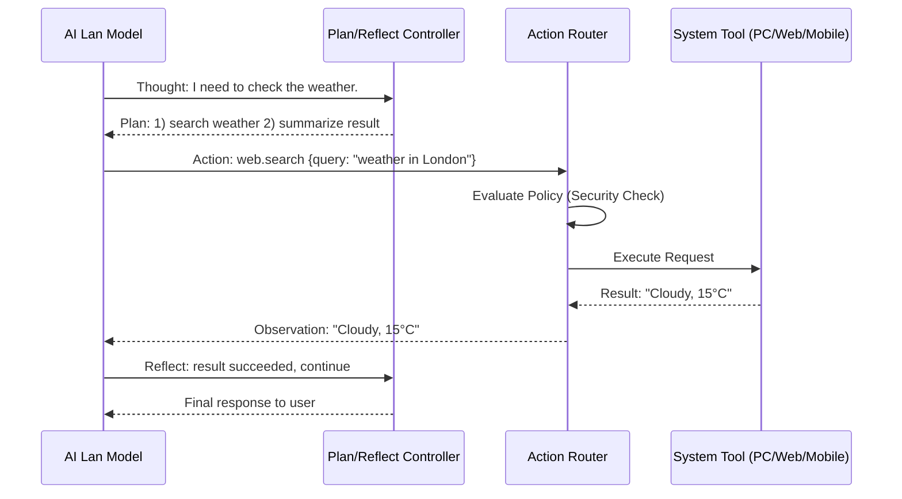
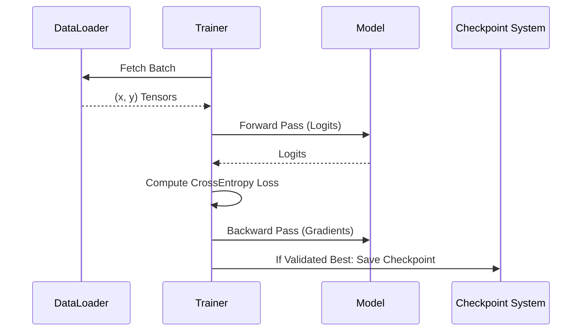

# AI Lan Architecture & Design 🏛️

This document provides a comprehensive technical overview of the AI Lan project, encompassing its mathematical foundations, architectural evolution, and strategic design phases.

---

## 1. System Architecture & Information Flow

AI Lan is built as a modular system where data flows from raw character input to trained neural weights and finally to autoregressive text generation.

### 🔄 Project Flow Diagram

### 🧠 Transformer Block Diagram

The **StackedTransformer-v2** is the flagship research/training architecture.
For production agency runtime (Phase 4.5A), the primary reasoning core is the GGUF local-brain path (`llama-cpp-python`) with policy-gated tool execution.

---

## 2. Core Components

- **Rotary Positional Embeddings (RoPE):** Replaces static embeddings with relative rotations in complex space, allowing the model to generalize to longer sequences than seen during training.
- **Stochastic Depth (DropPath):** Randomly drops entire layers during training (with linear decay across depth), significantly improving the training stability and generalization of deep (12+ layer) transformers.
- **KV Caching:** Optimized inference path that stores Key and Value tensors, reducing generation complexity from $O(N^2)$ to $O(N)$ per token.
- **Multi-Head Self-Attention (`n_head`):** Parallel attention mechanisms for capturing diverse linguistic patterns.
- **GELU Activation:** Gaussian Error Linear Units for smoother gradients and improved stability.

---

## 3. Phase 4.0: The ReAct Loop (Autonomous Agency)

AI Lan is moving from "Chat" to "Action." The ReAct++ loop adds explicit planning and reflection so failures do not devolve into repeated-action loops.

---

## 3. Trainer Implementation Cycle

The `Trainer` class in `training/trainer.py` manages the state and lifecycle of every training run.

---

## 4. Evolution Phases

AI Lan evolved through distinct stages to arrive at its current capability.

### Phase 1: Foundations (The Character Era)

- **Focus:** Basic character-level training, CPU-first loop, and workspace setup.
- **Outcome:** Established the first working pipeline using simple MLPs.

### Phase 2: Maturity & Baselines

- **Focus:** Introduction of Bigram baselines for honest quality comparison.
- **Outcome:** Model factory implementation and first shallow transformer components (Single-head attention).

### Phase 3: Scaling & Efficiency (Current)

- **Focus:** Full transformer blocks, BPE subword tokenization, and KV caching.
- **Goal:** Reach 20+ tokens/sec on modern CPUs with high logic coherence.

---

## 3. Mathematical Foundations

### GELU Activation

$\text{GELU}(x) = 0.5x(1 + \tanh(\sqrt{2/\pi}(x + 0.044715x^3)))$

Chosen over ReLU for its empirical performance in deep NLP models.

### Causal Masking

The attention mask is an upper-triangular matrix:

$\text{mask}_{i,j} = \begin{cases} 0 & j \leq i \\ -\infty & j > i \end{cases}$

---

## 4. Design Rationale

- **CPU-First Optimization:** All matrix operations are tailored for standard Windows hardware without requiring high-end GPUs.
- **Hybrid Tokenization:** Support for both fine-grained character analysis and efficient subword (BPE) processing.
- **Experiment First:** Every architectural change is tracked via run indexes and validated against Bigram baselines.

---

## 5. Current Implementation: Scaling and Efficiency (Phase 3.0)

Phase 3.0 focuses on modernizing the model for practical CPU use at scale.

### Key Features Under Scale

- **BPE (Byte-Pair Encoding):** Shifting from character-level analysis to subword units. This reduces the sequence length and significantly improves context understanding.
- **KV Caching:** Implementing Key-Value caching to store and reuse attention states, enabling real-time, streaming text generation by avoiding redundant recalculations of previous tokens.
- **Dynamic Quantization:** Utilizing 8-bit integer quantization (`torch.qint8`) to reduce model size by 4x and double CPU inference speeds without requiring retraining.
- **Agentive Groundwork:** Preparing the model for the **ReAct pattern** (Thought -> Action -> Observation), paving the way for Stage 4 (Active Agency).

## 6. Cross-Platform Control Engine

AI Lan is designed for seamless, multi-OS command execution. This capability is managed through a modular action system that bridges neural outputs with system-level APIs.

- **Windows & Linux (Native Automation):**
  - **Interface:** Utilizing `pyautogui` for mouse and keyboard control.
  - **Logic:** The AI translates intent (e.g., "Open Browser") into Python function calls using the **ReAct Pattern**.
- **Android (Mobile Interface):**
  - **Interface:** Leveraging the **Android Debug Bridge (ADB)**.
  - **Actions:** Capable of sending tap/swipe commands, launching mobile apps, and managing notifications directly from the PC host.
- **Smart Home Integration:**
  - **Interface:** Webhooks and REST APIs to **Home Assistant**.
  - **Scope:** Allows the AI to influence the physical environment (IoT lights, locks, and climate control).

---

## 6.5. Embodied AI Runtime

AI Lan is now extending into a CPU-first embodied loop that can see the screen, listen to the microphone, and speak back while still routing every action through the safety layer.

- **Vision Input:** Use `mss` for fast screenshots, `OpenCV` for frame processing, and `Tesseract` or `EasyOCR` for text extraction.
- **Optional Visual Grounding:** Add `Ultralytics` only if object detection is truly needed for a workflow.
- **Speech Input:** Use `Vosk` for the lightest offline speech-to-text path, then `whisper.cpp` if you need better accuracy and can afford extra CPU.
- **Speech Output:** Use `pyttsx3` for a minimal offline voice, then `Coqui TTS` for higher-quality speech generation.
- **Local Reasoning:** Use `llama.cpp` or `llama-cpp-python` for CPU-only local inference, tool selection, and context injection.
- **Prompt Contract:** Use structured XML output sections (`<thought>`, `<plan>`, `<action>`, `<reflection>`) to stabilize ReAct parsing across Phi-4/Llama variants.
- **Tool Schema Translator:** Auto-generate model-visible tool schema from `tools/*.py` signatures and router registry metadata (args, risk level, confirmation needs) instead of maintaining manual prompt schemas.
- **Dynamic Planning:** Require full multi-step planning only for medium/high-complexity tasks; permit direct execution for low-risk/simple actions to reduce latency.
- **Rolling Context:** Use summarization and memory compaction when context budget is near limit, rather than hard token truncation that drops task-critical early state.
- **Telemetry:** Persist structured agent traces (thought/plan/action/result/reflection) for dashboard and replay debugging.
- **Skill App Reference:** Study `OpenVoiceOS` for a maintained skills/plugin architecture around voice commands.
- **Realtime Loop:** screen/audio -> perception -> LLM -> tool -> observation -> speech.
- **Future Package Split:** extract the embodied layer into `perception/vision/` and `perception/audio/` while keeping the existing `tools/perception/` facade during migration.

## 6.6. Smart Persistent Engine (InferenceManager)

The production GGUF path uses an explicit inference abstraction layer rather than ad hoc direct calls.

- **InferenceManager role:** centralize model loading, residency policy, stream decoding, token-level tool trigger interception, and planner fallback behavior.
- **Residency policy (Option 4):** keep model resident by default; unload on memory pressure threshold instead of fixed idle timers.
- **Hardware mapping (i5 baseline):** prefer AVX2-capable wheels/builds and default `n_threads=4` to match physical cores while preserving OS responsiveness.
- **Tool-trigger streaming:** stop generation as soon as trigger text appears (for example `Action:`) and route to tool execution without waiting for full completion.
- **Fallback contract:** if local runtime/model fails, degrade deterministically to classic planning so user turns never stall.

---

## 7. Autonomic Self-Learning Patterns

Consistency and growth are achieved through automated feedback loops that refine the model's performance without manual retraining.

- **RLAIF (Reinforcement Learning from AI Feedback):** A "Critic" model evaluates the outputs of the "Actor" model, rewarding logical consistency and task success.
- **Background Fine-Tuning:** Scheduled daily cycles where the model processes new search data and interaction history to update its local weights.
- **Persistent Vector Memory:** Utilizing **ChromaDB** or **Qdrant** to store long-term context, enabling the AI to recall user preferences across years of operation.

---

## 8. Sentinel Observability Layer

AI Lan implements a high-fidelity "Sentinel" system for real-time monitoring of model internals and performance.

### 🔍 Layered Data Capture

Sentinel operates at three levels, controlled via environment variables:

1. **Basic Debugging:** Entry/Exit tracking for every function call.
2. **Automatic Variable Trace:** Line-by-line capture of local variables using `sys.settrace`. This provides "exact data" for debugging without manual print statements.
3. **Performance Profiling:** Continuous monitoring of CPU % and Memory (MB) delta per function using `psutil`.

### Automated Test Observability

The system is integrated into the `pytest` suite via `tests/conftest.py`.

- `AI_LAN_DEBUG` defaults to enabled for tests.
- `AI_LAN_TRACE` and `AI_LAN_PROFILE` default to disabled to avoid heavy runtime overhead.
- Individual tests can explicitly enable trace/profiling when deep diagnostics are required.

---

## 9. Layered Package Structure (Scaffolded)

To support Phase 4 and Phase 5 safely, AI Lan now includes a layered package scaffold:

- `agents/` for reasoning and planning logic.
- `tools/` for external actions and data interfaces.
- `memory/` for short-term, long-term, episodic, and summary memory.
- `safety/` for policy controls and confirmation gates.
- `router/` for schema validation and deterministic action dispatch.

This enforces strict separation between thinking, acting, remembering, and controlling.

The full target tree and migration details are documented in `docs/PROJECT_STRUCTURE.md`.

---

## 10. Recommended External Reference Stack

For Phase 4 and Phase 5 expansion, use the curated upstream shortlist in `docs/OPEN_SOURCE_REFERENCE.md` and keep the imports behind local facades.

- **Training and finetuning:** `nanoGPT`, `lit-gpt`, `tinygrad`, `PEFT`, `LoRA`, `QLoRA`, `TRL`, `datasets`, `DeepSpeed`
- **Agent and tool-use:** `LangChain`, `LangGraph`, `Semantic Kernel`, `AutoGen`, `Microsoft Agent Framework`, `CrewAI`, `OpenHands`, `Aider`, `Continue`, `Open Interpreter`, `OpenCodeInterpreter`, `OpenAgents`, `OpenCUA`, `Letta`
- **Browser and search:** `Playwright`, `browser-use`, `Tavily`, `SerpApi`, `Selenium`, `Playwright MCP`, `Tavily MCP`, `MCP Python SDK`
- **Desktop and Android control:** `PyAutoGUI`, `pynput`, `adb`, `scrcpy`, `Appium`, `uiautomator2`
- **Perception and vision:** `OpenCV`, `mss`, `Tesseract`, `EasyOCR`, `Segment Anything`, `Ultralytics`
- **Speech and local reasoning:** `Vosk`, `whisper.cpp`, `PyAudio`, `PortAudio`, `Coqui TTS`, `pyttsx3`, `llama.cpp`, `llama-cpp-python`
- **Voice skill apps:** `OpenVoiceOS`
- **Memory and learning:** `Chroma`, `Qdrant`, `FAISS`, `TRL`, `datasets`
- **Orchestration and IoT:** `Ray`, `Airflow`, `Home Assistant`, `ESPHome`

Adoption rule of thumb:

- pick one project per capability,
- add tests before integrating,
- keep the live path behind the repository's own `tools/`, `router/`, `memory/`, and `learning/` layers,
- and avoid mixing multiple overlapping frameworks until the first choice is stable.

---

## Last Updated

2026-04-10
