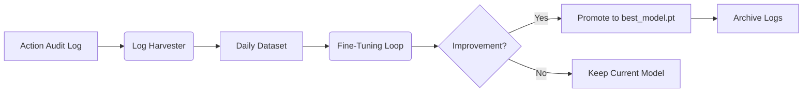

# AI Lan: Phase 5.0 - Sleep Mode (Self-Learning) Design

> **Status:** Drafted
> **Date:** 2026-04-06
> **Topic:** Automated nightly fine-tuning from successful action logs.

---

## 🏛️ Architecture Overview

The "Sleep Mode" pipeline transforms the agent's daily experiences (audit logs) into specialized training data. This enables AI Lan to move from a static model to a self-improving autonomous agent.

### 🔄 The Pipeline Flow

## 🛠️ Components

### 1. Log Harvester (`learning/dataset/harvester.py`)
- **Source:** `temp/action_audit.jsonl`
- **Filter:** `result.status == "executed"` (Successful actions only).
- **Target:** A training triplet for each entry:
    - **Context:** The prompt context used for the action (reconstructed or cached).
    - **Prompt:** The user message.
    - **Completion:** The `Thought` + `JSON Action Payload` that was successful.
- **Validation:** Every extracted entry must parse back into a valid `AgentAction` schema.

### 2. Fine-Tuning Loop (`learning/training/sleep_finetune.py`)
- **Model:** Starts from the current `models/best_model.pt`.
- **Hyperparameters:**
    - **Learning Rate:** Very low (e.g., 5e-5) to prevent catastrophic forgetting.
    - **Epochs:** 3-5 (Small context, dense data).
    - **Device:** `cpu` (Optimized for 4-core Intel i5).
- **Golden Set Validation:** After training, the model is tested against a core set of 20 "Ground Truth" instructions (e.g., "list files", "search weather") to ensure no regressions in basic logic.

### 3. Promotion & Registry (`learning/registry/model_registry.py`)
- **Backups:** Copies `best_model.pt` to `models/backups/best_model_v<N>.pt` before promotion.
- **Auto-Promotion:** If `New_Golden_Set_Accuracy >= Old_Golden_Set_Accuracy` AND `New_Loss < Old_Loss * 1.05`, the new model is promoted.
- **Metadata:** Updates `models/model_registry.json` with the new version, date, and training data count.

## ⚙️ Scheduling & Safety

- **Default Schedule:** 3:00 AM local time.
- **Inactivity Check:** The script `scripts/sleep_mode.py` checks for keyboard/mouse inactivity using `psutil` or `pyautogui` before starting.
- **User Interrupt:** If a message is received via the `dashboard_http.py` or `chat_interface.py`, the training process is paused or aborted to return CPU resources to the active session.

## 📂 File Impact

- **New:** `scripts/sleep_mode.py` (Main entry point)
- **New:** `learning/dataset/harvester.py` (Log-to-Dataset logic)
- **New:** `learning/training/sleep_finetune.py` (Nightly training loop)
- **Modify:** `learning/registry/model_registry.py` (Promotion logic)
- **Modify:** `training/config.py` (Add `AI_LAN_SLEEP_MODE_HOUR` and `AI_LAN_AUTO_PROMOTE`)

---

## 📊 Evaluation & Success Criteria

- **Metric:** Reduction in "JSON Parsing Errors" for actions over a 7-day period.
- **Metric:** Increase in "Successful Action" percentage from natural language prompts.
- **Success:** The agent demonstrates higher "re-use" of previously successful tool-use patterns.
