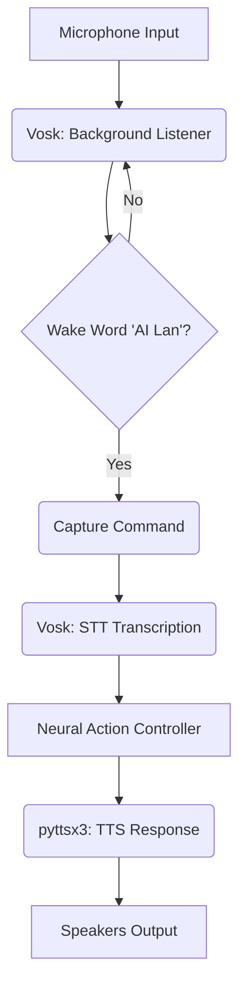

# AI Lan: Phase 4.5 - Voice Layer (Offline STT/TTS) Design

> **Status:** Drafted
> **Date:** 2026-04-06
> **Topic:** Always-listening offline voice interaction (Vosk + pyttsx3).

---

## 🏛️ Architecture Overview

The Voice Layer provides a hands-free, natural language interface for AI Lan. It bridges the gap between raw audio and the Neural Action Controller using high-speed, local processing.

### 🔄 The Voice Loop

## 🛠️ Components

### 1. Speech-to-Text (`perception/audio/stt.py`)
- **Engine:** `Vosk-API` (Offline, CPU-optimized).
- **Model:** Lightweight English model (~50MB) for rapid transcription.
- **Wake Word:** "AI Lan" (Configurable via `AI_LAN_WAKE_WORD`).
- **Buffer:** Continuous 16kHz mono audio stream via `PyAudio`.

### 2. Text-to-Speech (`perception/audio/tts.py`)
- **Engine:** `pyttsx3` (Offline, uses native system voices).
- **Voice Selection:** Toggle between Male (Voice 0) and Female (Voice 1) via `AI_LAN_VOICE_GENDER`.
- **Parameters:**
    - Rate: 175 wpm (words per minute).
    - Volume: 1.0 (Full volume).

### 3. Voice Controller (`scripts/voice_chat.py`)
- **Entry Point:** A dedicated CLI wrapper that manages the audio state and UI indicators.
- **Integration:** Pipes transcribed text directly into `ChatSession.handle_message` for action routing.
- **Interrupts:** Basic "Stop" / "Cancel" keyword detection to kill active TTS threads.

## ⚙️ Configuration & Environment

- **Dependencies:** `vosk`, `pyttsx3`, `pyaudio`.
- **Env Vars:**
    - `AI_LAN_VOICE_ENABLED=1`
    - `AI_LAN_WAKE_WORD="AI Lan"`
    - `AI_LAN_VOICE_GENDER="female"` (Options: "male", "female")
    - `AI_LAN_VOICE_RATE=175`

## 🛡️ Privacy & Performance

- **100% Offline:** No audio data leaves the local machine.
- **CPU Load:** Targeted at <15% total CPU usage for background listening on a 4-core i5.
- **Memory:** ~100MB RAM overhead for the Vosk model and audio buffers.

---

## 📊 Success Criteria

- **Wake Word Accuracy:** >90% in a quiet room.
- **Transcription Latency:** <500ms for short commands.
- **TTS Response:** Immediate feedback ("Listening...") upon wake word detection.
