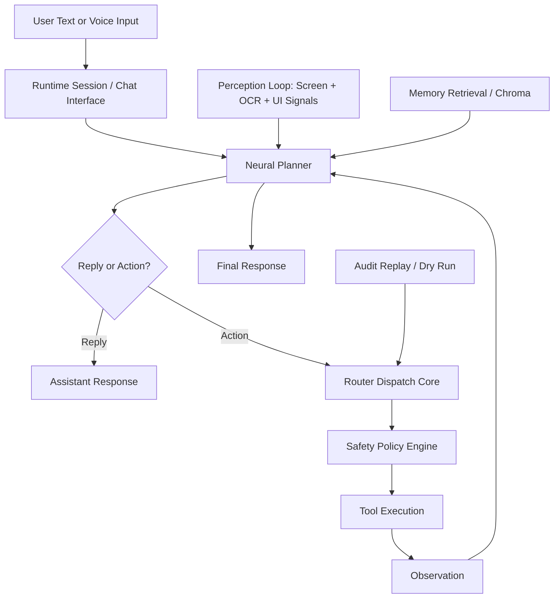

# AI Lan: Phase 4.5 - Embodied Neural Agency Design

> Status: Drafted
> Date: 2026-04-10
> Topic: Local reasoning engine + embodied perception loop for natural-language, offline-first agency.

---

## Goal

Phase 4.5 moves AI Lan from command-triggered tool execution to local neural planning that can interpret natural intent, select tools, observe outcomes, and continue safely.

Target user experience:

- "Look at my screen and tell me whether I have any urgent emails."
- "Search for the error on my screen, summarize the fix, and save notes."
- "Open Notepad and type a reminder after you confirm with me."

This phase does not remove the existing deterministic router. Instead, it introduces a local planner above the router and keeps the router/safety layers as the execution boundary.

---

## Design Principles

1. Local-first
- Reasoning, OCR, speech, and memory must work on-device.
- No required cloud dependency for the baseline Phase 4.5 flow.

2. Safety-first
- The LLM never executes actions directly.
- All actions continue to flow through `router/dispatch_core.py` and `safety/policy_engine.py`.
- Confirmation-gated actions remain confirmation-gated, even when suggested by the local brain.

3. Compatibility-first
- Keep current stable paths working.
- Extend `agents/react/`, `tools/perception/`, `runtime/`, and `scripts/` incrementally.
- Preserve existing Phase 4.1 and 4.3 guarantees: schema validation, audit logging, dry-run replay, and policy enforcement.

4. CPU-first
- Default stack must run acceptably on the current hardware baseline.
- Favor smaller GGUF models, bounded context windows, and low-overhead perception loops.

---

## Selected Stack

### 1. Local Brain

- Runtime: `llama-cpp-python`
- Model format: GGUF
- Preferred baseline model: Microsoft Phi-3 Mini 4K Instruct GGUF
- Optional larger model: Llama 3 Instruct GGUF when local hardware budget allows

Why:

- CPU-first local inference
- Strong structured prompting support
- Good fit for tool-selection and short-horizon reasoning
- Can be wrapped behind a local facade without coupling core runtime to model internals

### 2. Vision Perception

- Screen capture: `mss`
- OCR: `pytesseract` + Tesseract binary
- Optional image processing: `opencv-python`

Why:

- Already aligned with the current repo direction
- Minimal external complexity for first embodied slice
- Works with existing `tools/perception/vision.py` and `tools/perception/ocr.py`

### 3. Speech Interface

- STT: `vosk`
- TTS: `pyttsx3`

Why:

- Fully offline
- CPU-friendly
- Consistent with the existing voice-layer direction already drafted in repo docs

### 4. Memory Backend

- Baseline durable memory backend: `chromadb`

Why:

- Local vector store
- Fits the current `memory/` layer direction
- Good first productionizable backend before evaluating heavier alternatives

---

## High-Level Architecture



Core boundary:

- `agents/react/` decides what to do
- `router/` decides whether the requested action is valid
- `safety/` decides whether it is allowed
- `tools/` perform work

---

## Real Integration Points In This Repo

### Existing Components To Reuse

- `agents/react/controller.py`
  Current local planner that produces either a reply or an action payload.

- `agents/react/prompt.py`
  Existing prompt assembly path for tool-aware JSON output.

- `router/dispatch_core.py`
  Current execution boundary, tool registry, audit logging, and dry-run support.

- `safety/policy_engine.py`
  Current allow/deny/confirmation enforcement.

- `tools/perception/vision.py`
  Current screen-capture + OCR entry point.

- `tools/perception/ocr.py`
  Current image OCR implementation.

- `tools/perception/audio/tts.py`
  Existing offline speech output wrapper.

- `scripts/replay_audit.py`
  Existing dry-run replay path to compare future planner/policy behavior against historical requests.

### Proposed New Components

1. `core/inference/local_reasoning.py`
- Facade around `llama-cpp-python`
- Loads GGUF model
- Exposes structured inference for reply/action planning
- Keeps llama-specific code out of `agents/react/`

2. `agents/react/controller.py` update
- Add reasoning backend selection:
  - current text-generation path
  - llama-cpp structured planner path
- Keep `PlannedTurn` contract stable

3. `agents/react/tool_schema.py`
- Model-facing tool schema builder
- Converts `TOOL_REGISTRY` metadata into LLM-readable tool descriptions
- Avoids hardcoding prompt-only tool names forever

4. `tools/perception/audio/stt.py`
- Offline Vosk transcription helper
- Continuous microphone capture + wake-word mode

5. `runtime/perception_loop.py`
- Background screen/OCR sampler
- Writes compact situational context snapshots to runtime state
- Must remain low-frequency and CPU-bounded

6. `scripts/voice_chat.py`
- Voice-first CLI wrapper that pipes STT into runtime session handling

7. `memory/long_term/vector_store.py` or a Chroma facade
- Optional first durable local semantic memory path

---

## Step A: Tool Registration As A Model-Facing Plugin Layer

The model must not see arbitrary Python functions. It should receive a filtered, human-readable tool schema derived from the existing router registry.

### Contract

Each tool surfaced to the model should include:

- tool name
- description
- required args
- optional args
- risk level
- whether confirmation may be required

### Example

```json
{
  "name": "pc.list_workspace_files",
  "description": "List files in a workspace folder.",
  "required_args": [],
  "optional_args": ["relative_path", "limit", "include_hidden"],
  "confirmation_required": false,
  "risk": "low"
}
```

### Rule

The planner may propose only tools that exist in `TOOL_REGISTRY`.
The router remains the final authority.

---

## Step B: ReAct Controller With Llama-cpp

### Current State

`agents/react/controller.py` currently uses `core.inference.generate.generate_text()` to produce a JSON object representing either:

- a reply
- an action payload

### Target State

Replace the backend inference source, not the outer planning contract.

### Proposed Flow

1. Build prompt from:
- user message
- recent turns
- recent thoughts
- recent observations
- runtime context
- current tool schema

2. Pass prompt to `core/inference/local_reasoning.py`

3. Parse one JSON object from the model output

4. Return a `PlannedTurn`

5. If action mode:
- call router dispatch
- observe result
- continue loop if needed

### ReAct Loop Requirements

- Cap at small max-step count, default 3 to 5
- Abort on repeated identical action proposals
- Abort on malformed repeated outputs
- Prefer reply over infinite tool churn
- Store action/observation history for post-hoc auditability

### Failure Handling

If llama-cpp is unavailable:

- fall back to current planner path
- or disable neural planning explicitly and return deterministic reply mode

---

## Step C: Always-On Perception Loop

The perception loop gives the planner situational awareness without moving tool execution into the background.

### Inputs

- periodic screenshots via `mss`
- OCR text extraction via existing OCR layer
- optional window/process summary from system tools

### Output

Compact runtime context block, for example:

```text
Visible application hints:
- VS Code open
- Outlook window title detected

OCR summary:
- Inbox (14 unread)
- Build failed: ModuleNotFoundError
```

### Constraints

- default capture interval should be conservative, e.g. 5 to 15 seconds
- do not persist raw screenshots by default
- persist only summarized text unless explicitly enabled
- allow easy disable via config/env

### Safety Requirement

Perception itself is read-only, but any action inferred from it still goes through router + safety.

---

## Memory Integration

Phase 4.5 memory should remain narrow and useful.

### Initial Usage

- store user preferences
- store recent stable facts
- store task/session summaries

### Retrieval

- planner gets top-k memory hits as part of runtime context
- memory remains advisory, not authoritative

### Guardrails

- user-controlled retention policy
- opt-out path for persistent memory
- no silent persistence of sensitive clipboard/screen raw content

---

## Configuration Plan

New environment variables to add when implementation begins:

- `AI_LAN_REASONING_BACKEND=classic|llama_cpp`
- `AI_LAN_LLAMACPP_MODEL_PATH=models/phi3-mini.gguf`
- `AI_LAN_LLAMACPP_CTX=4096`
- `AI_LAN_LLAMACPP_THREADS=4`
- `AI_LAN_LLAMACPP_GPU_LAYERS=0`
- `AI_LAN_PERCEPTION_ENABLED=0|1`
- `AI_LAN_PERCEPTION_INTERVAL_SEC=10`
- `AI_LAN_STT_ENABLED=0|1`
- `AI_LAN_TTS_ENABLED=0|1`
- `AI_LAN_MEMORY_BACKEND=none|chroma`
- `AI_LAN_CHROMA_PATH=temp/chroma`

These should be loaded through `training/config.py` and exposed in a typed way, consistent with the current `ProjectConfig` pattern.

---

## Safety Model For Neural Agency

Neural planning increases ambiguity, so the execution boundary must become stricter, not looser.

### Mandatory Rules

1. Model output never bypasses `parse_agent_action()`
2. Model output never bypasses `validate_action_args()`
3. Model output never bypasses `evaluate_action_policy()`
4. Dry-run mode must remain available for planner evaluation
5. Audit replay must remain the regression mechanism for policy drift

### Recommended Additional Checks

- repeated-action suppression
- step budget enforcement
- unsafe-action cooldown
- planner confidence heuristic or structured refusal when uncertain

---

## Testing Strategy

### Unit Tests

- prompt construction with tool schema
- llama-cpp backend adapter behavior with mocked model responses
- planner parsing of reply vs action outputs
- fallback behavior when backend is unavailable
- perception loop summarization and throttling
- STT/TTS wrapper smoke behavior with mocks

### Router/Safety Tests

- model-proposed action still hits confirmation/rejection paths correctly
- dry-run planner evaluation never invokes side-effect handlers
- audit replay can be used against neural-generated action traces

### Performance Tests

- prompt-to-plan latency under CPU target
- perception loop CPU overhead at configured interval
- memory retrieval latency for small local index

### Human Smoke Tests

- "Look at my screen" style request
- "Open Notepad" request with confirmation gate
- "Summarize this error" request using OCR text
- voice wake-word to response path

---

## Delivery Plan

### Phase 4.5A - Local Brain

- Add llama-cpp facade
- Add backend selection in ReAct controller
- Keep current deterministic fallback
- Add unit tests for structured planner outputs

### Phase 4.5B - Embodied Perception

- Add perception loop runtime module
- Reuse OCR/vision tools for summarized situational context
- Add config + low-overhead sampling safeguards

### Phase 4.5C - Voice Interface

- Add Vosk STT wrapper
- Add `scripts/voice_chat.py`
- Connect TTS path to runtime replies

### Phase 4.5D - Local Memory

- Add Chroma facade
- Feed retrieval snippets into runtime context
- Add retention controls and tests

---

## Success Criteria

Functional:

- user can issue a natural-language request without tool-specific phrasing
- planner can choose from registered tools and generate valid structured action payloads
- perception loop adds useful context for screen-aware queries
- all actions remain auditable and policy-gated

Quality:

- no regression in non-integration test suite
- planner path works fully offline
- dry-run and audit replay remain available for new planner behavior

Performance:

- acceptable response latency on current CPU baseline
- perception loop does not dominate foreground CPU usage

---

## Non-Goals For First Slice

- full autonomous desktop control without confirmation
- cloud-only reasoning dependencies
- multi-agent orchestration
- camera-first or microphone-always-recording behavior by default
- replacing the router with model-native execution

---

## Recommended First Implementation Slice

If implementation starts immediately, begin here:

1. Add `core/inference/local_reasoning.py`
2. Add `AI_LAN_REASONING_BACKEND` config support
3. Update `agents/react/controller.py` to support `llama_cpp`
4. Add mocked unit tests for planner outputs
5. Add a short smoke script to validate local brain loading without changing runtime defaults

This gives AI Lan a real local reasoning engine while preserving the current safe architecture.